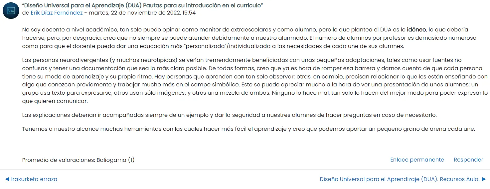

# DUA: Diseño Universal para el Aprendizaje
En este módulo, exploraremos el Diseño Universal para el Aprendizaje (DUA) y cómo aplicar sus principios en el aula. Aprenderás a identificar barreras en el aprendizaje y a utilizar herramientas digitales para hacer los contenidos más accesibles, adaptando la información a las diferentes necesidades del alumnado.

  
<h2>Resumen de vídeos</h2>

  

DUA: Diseño Universal de Aprendizaje. Pertenece al quinto área: empoderamiento de los estudiantes. Se centra en la educación para satisfacer todas las necesidades del alumnado en el aula, incluidas las de las personas con dificultades de atención y aprendizaje.

Propone presentar la información en más de un formato.

Fomenta el uso de diferentes herramientas para fomentar el aprendizaje a distancia e híbrido y una forma más personalizada de enseñanza.

Medios para la expresión del alumnado: escrito, presentación, proyecto, etc.

Ofrecer un grado de compromiso/responsabilidad al alumnado.

Concepto de integración.

Lectura accesible: propone una serie de “reglas” en cuanto a ortografía, gramática, léxico, estilo, imágenes y tipografía con el fin de llegar al mayor número de alumnos.

  1. Especificar los objetivos de una lección. (Y que el alumnado se marque objetivos).
  2. Ofrecer múltiples formas de evaluación. (Herramientas para completar una tarea).
  3. Crear espacios de trabajo flexible. (E, incluso, brindarles la oportunidad de usar cascos para realizar una actividad individual).
  4. Compartir feedback regular.
  5. Facilitar contenidos a través de las TIC.
       1. Programas o herramientas TIC
           - Programas: google presentaciones, genially, Canva, Pinterest (hay muchas infografías y contenido didáctico), Kahoot, Powtoon, etc.
           - Herramientas: ordenadores, pizarras electrónicas, proyector.
        2. Lenguaje Audiovisual
        3. Gestión de la información: búsquedas, selección, organización y tratamiento de la misma.

 

  - Test “¿Qué sabes sobre el marco de IDU (DUA)?”

Vídeos y presentación sobre “Diseño Universal para el Aprendizaje (DUA)”

  - Foro: Participa con una entrada en el Foro. (Tarea 2.2.) (SACA UNA CAPTURA DE PANTALLA A TU APORTACIÓN EN EL FORO Y TENLA A MANO PARA LA ACTIVIDAD DEL ÚLTIMO MÓDULO).

# Tarea 2.1: Herramientas DUA
- **Audio (Podcast)**: Elige una actividad de clase y explica cómo superar las barreras sensoriales o comprensivas. Puedes grabar el audio con tu teléfono móvil.
- **Vídeo**: Diseña una ayuda audiovisual para una actividad realizada. La edición puede hacerse con herramientas como PowerPoint (exportando la presentación como vídeo), Clipchamp, [Filmora](https://filmora.wondershare.es/) Lightworks, iMovie (exclusivo para MacOs) o Vegas Pro. Se recomienda Clipchamp por su facilidad de uso.
    - Para esta tarea, si no tienes experiencia previa, aprenderás a manejar pistas de vídeo y audio, así como a aplicar efectos entre fragmentos (aunque esto último es opcional).
    - Para compartir el vídeo en tu página de Notion, la mejor opción es subirlo en modo oculto en YouTube (para que no aparezca en tu canal, pero sí en tu portfolio) e insertar el enlace.
- **Lectura Sencilla**: Elige una actividad y adáptala a un formato de lectura fácil siguiendo las pautas proporcionadas en Moodlegunea.

# Tarea 2.2: Analiza un recurso y comparte en el foro una opinión con reflexión (10-15 líneas).
- Menciona el recurso que vas a analizar y, a continuación, escribe tu reflexión.

**Ejemplo:**
  

    
  

- Test “¿Qué has aprendido sobre el marco IDU/DUA?”
  

## Apoya mi trabajo
Si quieres apoyar este curso, puedes hacerlo aquí: [Donar](https://paypal.me/eriksenwolf?locale.x=es_ES&country.x=ES)
